# INTEGRATE SUPPORT SALES MANAGEMENT SYSTEM
## Entity Relationship Diagram (ERD) & Data Dictionary

---

## 1. ENTITY RELATIONSHIP DIAGRAM (ERD)

```mermaid
erDiagram
    USERS {
        int Id PK
        nvarchar FirstName
        nvarchar LastName
        nvarchar Email UK
        nvarchar PasswordHash
        nvarchar Phone
        int Role
        bit IsActive
        datetime2 CreatedAt
        datetime2 LastLoginAt
        datetime2 UpdatedAt
    }

    CUSTOMERS {
        int Id PK
        nvarchar FirstName
        nvarchar LastName
        nvarchar Email UK
        nvarchar Phone
        nvarchar Company
        nvarchar Address
        nvarchar City
        nvarchar State
        nvarchar PostalCode
        nvarchar Country
        int Type
        datetime2 CreatedAt
        datetime2 UpdatedAt
        int UserId FK "UK"
    }

    CALLS {
        int Id PK
        int CustomerId FK
        int AgentId FK
        int Type
        int Status
        datetime2 StartTime
        datetime2 EndTime
        nvarchar Subject
        nvarchar Notes
        nvarchar Outcome
        bit IsEscalated
        datetime2 CreatedAt
    }

    TICKETS {
        int Id PK
        nvarchar TicketNumber UK
        int CustomerId FK
        int AssignedAgentId FK
        int CreatedByUserId FK
        nvarchar Title
        nvarchar Description
        int Priority
        int Status
        int Category
        datetime2 CreatedAt
        datetime2 UpdatedAt
        datetime2 ResolvedAt
        nvarchar Resolution
        int RelatedCallId FK
    }

    TICKET_COMMENTS {
        int Id PK
        int TicketId FK
        int UserId FK
        nvarchar Comment
        bit IsInternal
        datetime2 CreatedAt
        datetime2 UpdatedAt
    }

    PRODUCTS {
        int Id PK
        nvarchar Name
        nvarchar Description
        nvarchar SKU UK
        decimal Price
        bit IsActive
        bit IsSubscription
        int SubscriptionMonths
        int Category
        int StockQuantity
        int MinStockLevel
        datetime2 CreatedAt
        datetime2 UpdatedAt
        nvarchar ImageUrl
    }

    ORDERS {
        int Id PK
        nvarchar OrderNumber UK
        int CustomerId FK
        int AgentId FK
        int RelatedCallId FK
        int Status
        decimal TotalAmount
        decimal TaxAmount
        decimal DiscountAmount
        decimal FinalAmount
        datetime2 OrderDate
        datetime2 ShippingDate
        datetime2 DeliveryDate
        nvarchar ShippingAddress
        nvarchar BillingAddress
        nvarchar Notes
        datetime2 CreatedAt
        datetime2 UpdatedAt
        int PaymentStatus
        nvarchar PaymentIntentId
    }

    ORDER_DETAILS {
        int Id PK
        int OrderId FK
        int ProductId FK
        int Quantity
        decimal UnitPrice
        decimal DiscountPercentage
        decimal TotalPrice
        datetime2 CreatedAt
    }

    INVOICES {
        int Id PK
        nvarchar InvoiceNumber UK
        int OrderId FK
        int CustomerId FK
        decimal SubtotalAmount
        decimal TaxAmount
        decimal DiscountAmount
        decimal TotalAmount
        int Status
        datetime2 IssueDate
        datetime2 DueDate
        datetime2 PaidDate
        nvarchar Notes
        datetime2 CreatedAt
        datetime2 UpdatedAt
    }

    PAYMENTS {
        int Id PK
        nvarchar PaymentNumber UK
        int InvoiceId FK
        decimal Amount
        nvarchar PaymentMethod
        nvarchar TransactionReference
        int Status
        datetime2 PaymentDate
        nvarchar Notes
        datetime2 CreatedAt
    }

    FINANCIAL_TRANSACTIONS {
        int Id PK
        nvarchar TransactionNumber UK
        int Type
        decimal Amount
        nvarchar Currency
        datetime2 TransactionDate
        int OrderId FK
        int PaymentId FK
        int Status
        nvarchar PaymentMethod
        nvarchar Description
        datetime2 CreatedAt
    }

    PERFORMANCE_REPORTS {
        int Id PK
        int AgentId FK
        int TicketsResolved
        time AvgHandlingTime
        decimal SalesConversionRate
        int TotalCallsHandled
        time TotalCallDuration
        decimal ResolutionRate
        datetime2 ReportDate
    }

    AUDIT_LOGS {
        int Id PK
        nvarchar Action
        nvarchar Description
        int UserId FK
        nvarchar UserEmail
        datetime2 Timestamp
        nvarchar Details
    }

    %% ===== RELATIONSHIPS =====

    USERS ||--o| CUSTOMERS : "registers as"
    USERS ||--o{ CALLS : "handles"
    USERS ||--o{ TICKETS : "is assigned"
    USERS ||--o{ TICKETS : "creates"
    USERS ||--o{ ORDERS : "processes"
    USERS ||--o{ TICKET_COMMENTS : "writes"
    USERS ||--o{ PERFORMANCE_REPORTS : "has"
    USERS ||--o{ AUDIT_LOGS : "generates"

    CUSTOMERS ||--o{ CALLS : "participates in"
    CUSTOMERS ||--o{ TICKETS : "raises"
    CUSTOMERS ||--o{ ORDERS : "places"
    CUSTOMERS ||--o{ INVOICES : "billed to"

    CALLS ||--o{ TICKETS : "generates"
    CALLS ||--o{ ORDERS : "leads to"

    TICKETS ||--o{ TICKET_COMMENTS : "has"

    ORDERS ||--o{ ORDER_DETAILS : "contains"
    ORDERS ||--o{ INVOICES : "generates"
    ORDERS ||--o{ FINANCIAL_TRANSACTIONS : "records"

    PRODUCTS ||--o{ ORDER_DETAILS : "included in"

    INVOICES ||--o{ PAYMENTS : "paid by"

    PAYMENTS ||--o{ FINANCIAL_TRANSACTIONS : "records"
```



---

## 2. RELATIONSHIP SUMMARY TABLE

| Parent Entity              | Child Entity              | Relationship | FK Column         | On Delete   | Description                                     |
|----------------------------|---------------------------|--------------|-------------------|-------------|-------------------------------------------------|
| **Users**                  | Customers                 | 1 : 0..1     | UserId            | SET NULL    | A user can optionally register as a customer    |
| **Users**                  | Calls                     | 1 : 0..*     | AgentId           | RESTRICT    | An agent handles many calls                     |
| **Users**                  | Tickets                   | 1 : 0..*     | AssignedAgentId   | SET NULL    | An agent can be assigned many tickets           |
| **Users**                  | Tickets                   | 1 : 0..*     | CreatedByUserId   | NO ACTION   | A user creates many tickets                     |
| **Users**                  | Orders                    | 1 : 0..*     | AgentId           | NO ACTION   | An agent processes many orders                  |
| **Users**                  | TicketComments            | 1 : 0..*     | UserId            | NO ACTION   | A user writes many ticket comments              |
| **Users**                  | PerformanceReports        | 1 : 0..*     | AgentId           | CASCADE     | An agent has many performance reports           |
| **Users**                  | AuditLogs                 | 1 : 0..*     | UserId            | SET NULL    | A user generates many audit log entries         |
| **Customers**              | Calls                     | 1 : 0..*     | CustomerId        | CASCADE     | A customer participates in many calls           |
| **Customers**              | Tickets                   | 1 : 0..*     | CustomerId        | CASCADE     | A customer raises many tickets                  |
| **Customers**              | Orders                    | 1 : 0..*     | CustomerId        | RESTRICT    | A customer places many orders                   |
| **Customers**              | Invoices                  | 1 : 0..*     | CustomerId        | NO ACTION   | A customer is billed on many invoices           |
| **Calls**                  | Tickets                   | 1 : 0..*     | RelatedCallId     | NO ACTION   | A call can generate related tickets             |
| **Calls**                  | Orders                    | 1 : 0..*     | RelatedCallId     | SET NULL    | A call can lead to orders                       |
| **Tickets**                | TicketComments            | 1 : 0..*     | TicketId          | CASCADE     | A ticket has many comments                      |
| **Orders**                 | OrderDetails              | 1 : 1..*     | OrderId           | CASCADE     | An order contains one or more line items        |
| **Orders**                 | Invoices                  | 1 : 0..*     | OrderId           | RESTRICT    | An order generates one or more invoices         |
| **Orders**                 | FinancialTransactions     | 1 : 0..*     | OrderId           | NO ACTION   | An order records financial transactions         |
| **Products**               | OrderDetails              | 1 : 0..*     | ProductId         | RESTRICT    | A product appears in many order details         |
| **Invoices**               | Payments                  | 1 : 0..*     | InvoiceId         | RESTRICT    | An invoice is paid by one or more payments      |
| **Payments**               | FinancialTransactions     | 1 : 0..*     | PaymentId         | NO ACTION   | A payment records financial transactions        |

---

## 3. DATA DICTIONARY

### 3.1 USERS

| # | Field Name    | Data Type       | Length | Nullable | Default       | Constraint      | Description                                                       |
|---|---------------|-----------------|--------|----------|---------------|-----------------|-------------------------------------------------------------------|
| 1 | Id            | int             | -      | NO       | IDENTITY      | PK              | Unique identifier for the user                                    |
| 2 | FirstName     | nvarchar        | 20     | NO       | -             | Required        | User's first name                                                 |
| 3 | LastName      | nvarchar        | 20     | NO       | -             | Required        | User's last name                                                  |
| 4 | Email         | nvarchar        | 255    | NO       | -             | Required, UK    | User's email address (unique, used for login)                     |
| 5 | PasswordHash  | nvarchar        | 255    | NO       | -             | Required        | BCrypt-hashed password                                            |
| 6 | Phone         | nvarchar        | 11     | NO       | -             | Required        | User's phone number (11 digits)                                   |
| 7 | Role          | int             | -      | NO       | 1 (Agent)     | Enum            | User role: 0=Customer, 1=Agent, 2=Supervisor, 3=Admin, 4=SuperAdmin |
| 8 | IsActive      | bit             | -      | NO       | 1 (true)      | -               | Whether the user account is active                                |
| 9 | CreatedAt     | datetime2       | -      | NO       | GETUTCDATE()  | -               | Timestamp when the user was created                               |
|10 | LastLoginAt   | datetime2       | -      | YES      | NULL          | -               | Timestamp of the user's most recent login                         |
|11 | UpdatedAt     | datetime2       | -      | YES      | NULL          | -               | Timestamp of the last profile update                              |

**Indexes:** PK_Users (Id), IX_Users_Email (Email - UNIQUE)

---

### 3.2 CUSTOMERS

| # | Field Name  | Data Type  | Length | Nullable | Default        | Constraint   | Description                                            |
|---|-------------|------------|--------|----------|----------------|--------------|--------------------------------------------------------|
| 1 | Id          | int        | -      | NO       | IDENTITY       | PK           | Unique identifier for the customer                     |
| 2 | FirstName   | nvarchar   | 20     | NO       | -              | Required     | Customer's first name                                  |
| 3 | LastName    | nvarchar   | 20     | NO       | -              | Required     | Customer's last name                                   |
| 4 | Email       | nvarchar   | 255    | NO       | -              | Required, UK | Customer's email address (unique)                      |
| 5 | Phone       | nvarchar   | 11     | NO       | -              | Required     | Customer's phone number (11 digits)                    |
| 6 | Company     | nvarchar   | 255    | YES      | NULL           | -            | Company or organization name                           |
| 7 | Address     | nvarchar   | 500    | YES      | NULL           | -            | Street address                                         |
| 8 | City        | nvarchar   | 100    | YES      | NULL           | -            | City name                                              |
| 9 | State       | nvarchar   | 100    | YES      | NULL           | -            | State or province                                      |
|10 | PostalCode  | nvarchar   | 20     | YES      | NULL           | -            | Postal / ZIP code                                      |
|11 | Country     | nvarchar   | 100    | YES      | NULL           | -            | Country name                                           |
|12 | Type        | int        | -      | NO       | 1 (Individual) | Enum         | Customer type: 1=Individual, 2=Business, 3=Enterprise  |
|13 | CreatedAt   | datetime2  | -      | NO       | GETUTCDATE()   | -            | Timestamp when the customer record was created         |
|14 | UpdatedAt   | datetime2  | -      | YES      | NULL           | -            | Timestamp of the last update                           |
|15 | UserId      | int        | -      | YES      | NULL           | FK, UK       | Links to Users table for registered customers (unique) |

**Indexes:** PK_Customers (Id), IX_Customers_Email (Email - UNIQUE), IX_Customers_UserId (UserId - UNIQUE)

---

### 3.3 CALLS

| # | Field Name  | Data Type  | Length | Nullable | Default       | Constraint | Description                                                 |
|---|-------------|------------|--------|----------|---------------|------------|-------------------------------------------------------------|
| 1 | Id          | int        | -      | NO       | IDENTITY      | PK         | Unique identifier for the call                              |
| 2 | CustomerId  | int        | -      | NO       | -             | FK         | References Customers(Id) - the customer in the call         |
| 3 | AgentId     | int        | -      | NO       | -             | FK         | References Users(Id) - the agent handling the call          |
| 4 | Type        | int        | -      | NO       | 1 (Inbound)   | Enum       | Call type: 1=Inbound, 2=Outbound, 3=FollowUp               |
| 5 | Status      | int        | -      | NO       | 3 (Completed) | Enum       | Call status: 1=Scheduled, 2=InProgress, 3=Completed, 4=Missed, 5=Cancelled |
| 6 | StartTime   | datetime2  | -      | NO       | GETUTCDATE()  | -          | When the call started                                       |
| 7 | EndTime     | datetime2  | -      | YES      | NULL          | -          | When the call ended                                         |
| 8 | Subject     | nvarchar   | 1000   | YES      | NULL          | -          | Brief subject or reason for the call                        |
| 9 | Notes       | nvarchar   | 2000   | YES      | NULL          | -          | Detailed notes taken during/after the call                  |
|10 | Outcome     | nvarchar   | 100    | YES      | NULL          | -          | Call outcome (e.g., Resolved, Escalated, Callback Required) |
|11 | IsEscalated | bit        | -      | NO       | 0 (false)     | -          | Whether the call was escalated to a supervisor              |
|12 | CreatedAt   | datetime2  | -      | NO       | GETUTCDATE()  | -          | Timestamp when the call record was created                  |

**Indexes:** PK_Calls (Id), IX_Calls_CustomerId, IX_Calls_AgentId

---

### 3.4 TICKETS

| # | Field Name      | Data Type  | Length | Nullable | Default      | Constraint | Description                                                       |
|---|-----------------|------------|--------|----------|--------------|------------|-------------------------------------------------------------------|
| 1 | Id              | int        | -      | NO       | IDENTITY     | PK         | Unique identifier for the ticket                                  |
| 2 | TicketNumber    | nvarchar   | 50     | NO       | -            | Required, UK | System-generated unique ticket number (e.g., TKT-20260216-001) |
| 3 | CustomerId      | int        | -      | NO       | -            | FK         | References Customers(Id) - the customer who raised the ticket     |
| 4 | AssignedAgentId | int        | -      | YES      | NULL         | FK         | References Users(Id) - the agent assigned to the ticket           |
| 5 | CreatedByUserId | int        | -      | YES      | NULL         | FK         | References Users(Id) - the user who created the ticket            |
| 6 | Title           | nvarchar   | 200    | NO       | -            | Required   | Short title describing the issue                                  |
| 7 | Description     | nvarchar   | 2000   | NO       | -            | Required   | Detailed description of the issue                                 |
| 8 | Priority        | int        | -      | NO       | 2 (Medium)   | Enum       | Priority: 1=Low, 2=Medium, 3=High, 4=Critical                    |
| 9 | Status          | int        | -      | NO       | 1 (Open)     | Enum       | Status: 1=Open, 2=InProgress, 3=PendingCustomer, 4=Resolved, 5=Closed, 6=Reopened |
|10 | Category        | int        | -      | NO       | 1 (General)  | Enum       | Category: 1=General, 2=Technical, 3=Billing, 4=Account, 5=Product, 6=Service |
|11 | CreatedAt       | datetime2  | -      | NO       | GETUTCDATE() | -          | Timestamp when the ticket was created                             |
|12 | UpdatedAt       | datetime2  | -      | YES      | GETUTCDATE() | -          | Timestamp of the last update                                      |
|13 | ResolvedAt      | datetime2  | -      | YES      | NULL         | -          | Timestamp when the ticket was resolved                            |
|14 | Resolution      | nvarchar   | 1000   | YES      | NULL         | -          | Resolution notes describing how the issue was resolved            |
|15 | RelatedCallId   | int        | -      | YES      | NULL         | FK         | References Calls(Id) - the call that generated this ticket        |

**Indexes:** PK_Tickets (Id), IX_Tickets_TicketNumber (UNIQUE), IX_Tickets_CustomerId, IX_Tickets_AssignedAgentId, IX_Tickets_CreatedByUserId, IX_Tickets_RelatedCallId

---

### 3.5 TICKET_COMMENTS

| # | Field Name | Data Type  | Length | Nullable | Default       | Constraint | Description                                            |
|---|------------|------------|--------|----------|---------------|------------|--------------------------------------------------------|
| 1 | Id         | int        | -      | NO       | IDENTITY      | PK         | Unique identifier for the comment                      |
| 2 | TicketId   | int        | -      | NO       | -             | FK         | References Tickets(Id) - the ticket being commented on |
| 3 | UserId     | int        | -      | NO       | -             | FK         | References Users(Id) - the user who wrote the comment  |
| 4 | Comment    | nvarchar   | 2000   | NO       | -             | Required   | The comment text                                       |
| 5 | IsInternal | bit        | -      | NO       | 0 (false)     | -          | If true, comment is visible only to internal staff     |
| 6 | CreatedAt  | datetime2  | -      | NO       | GETUTCDATE()  | -          | Timestamp when the comment was posted                  |
| 7 | UpdatedAt  | datetime2  | -      | YES      | NULL          | -          | Timestamp of the last edit                             |

**Indexes:** PK_TicketComments (Id), IX_TicketComments_TicketId, IX_TicketComments_UserId

---

### 3.6 PRODUCTS

| # | Field Name         | Data Type  | Length | Nullable | Default       | Constraint   | Description                                                     |
|---|--------------------|------------|--------|----------|---------------|--------------|-----------------------------------------------------------------|
| 1 | Id                 | int        | -      | NO       | IDENTITY      | PK           | Unique identifier for the product                               |
| 2 | Name               | nvarchar   | 200    | NO       | -             | Required     | Product display name                                            |
| 3 | Description        | nvarchar   | 500    | YES      | NULL          | -            | Detailed product description                                    |
| 4 | SKU                | nvarchar   | 50     | NO       | -             | Required, UK | Stock Keeping Unit - unique product code                        |
| 5 | Price              | decimal    | 18,2   | NO       | -             | -            | Unit price in system currency                                   |
| 6 | IsActive           | bit        | -      | NO       | 1 (true)      | -            | Whether the product is available for sale                       |
| 7 | IsSubscription     | bit        | -      | NO       | 0 (false)     | -            | Whether this is a subscription-based product                    |
| 8 | SubscriptionMonths | int        | -      | YES      | NULL          | -            | Duration of subscription in months (null if not subscription)   |
| 9 | Category           | int        | -      | NO       | 7 (TShirt)    | Enum         | Category: 1=Hardware, 2=Software, 3=Subscription, 4=Service, 5=License, 6=Apparel, 7=TShirt, 8=Dress, 9=Jacket, 10=Sweater |
|10 | StockQuantity      | int        | -      | NO       | 0             | -            | Current stock level                                             |
|11 | MinStockLevel      | int        | -      | NO       | 5             | -            | Minimum stock threshold for reorder alerts                      |
|12 | CreatedAt          | datetime2  | -      | NO       | GETUTCDATE()  | -            | Timestamp when the product was created                          |
|13 | UpdatedAt          | datetime2  | -      | YES      | NULL          | -            | Timestamp of the last update                                    |
|14 | ImageUrl           | nvarchar   | 500    | YES      | NULL          | -            | URL to the product image                                        |

**Indexes:** PK_Products (Id), IX_Products_SKU (UNIQUE)

---

### 3.7 ORDERS

| # | Field Name      | Data Type  | Length | Nullable | Default       | Constraint   | Description                                                        |
|---|-----------------|------------|--------|----------|---------------|--------------|--------------------------------------------------------------------|
| 1 | Id              | int        | -      | NO       | IDENTITY      | PK           | Unique identifier for the order                                    |
| 2 | OrderNumber     | nvarchar   | 50     | NO       | -             | Required, UK | System-generated unique order number (e.g., ORD-20260216-001)      |
| 3 | CustomerId      | int        | -      | NO       | -             | FK           | References Customers(Id) - the customer who placed the order       |
| 4 | AgentId         | int        | -      | YES      | NULL          | FK           | References Users(Id) - the sales agent who processed the order     |
| 5 | RelatedCallId   | int        | -      | YES      | NULL          | FK           | References Calls(Id) - the call that led to this order             |
| 6 | Status          | int        | -      | NO       | 1 (Pending)   | Enum         | Order status: 1=Pending, 2=Processing, 3=Shipped, 4=Delivered, 5=Cancelled, 6=Refunded |
| 7 | TotalAmount     | decimal    | 18,2   | NO       | -             | -            | Subtotal before tax and discount                                   |
| 8 | TaxAmount       | decimal    | 18,2   | NO       | -             | -            | Tax amount                                                         |
| 9 | DiscountAmount  | decimal    | 18,2   | NO       | -             | -            | Discount amount applied                                            |
|10 | FinalAmount     | decimal    | 18,2   | NO       | -             | -            | Final payable amount (TotalAmount + TaxAmount - DiscountAmount)    |
|11 | OrderDate       | datetime2  | -      | NO       | GETUTCDATE()  | -            | Date and time the order was placed                                 |
|12 | ShippingDate    | datetime2  | -      | YES      | NULL          | -            | Date and time the order was shipped                                |
|13 | DeliveryDate    | datetime2  | -      | YES      | NULL          | -            | Date and time the order was delivered                              |
|14 | ShippingAddress | nvarchar   | 500    | YES      | NULL          | -            | Full shipping address                                              |
|15 | BillingAddress  | nvarchar   | 500    | YES      | NULL          | -            | Full billing address                                               |
|16 | Notes           | nvarchar   | 1000   | YES      | NULL          | -            | Additional order notes or special instructions                     |
|17 | CreatedAt       | datetime2  | -      | NO       | GETUTCDATE()  | -            | Timestamp when the order record was created                        |
|18 | UpdatedAt       | datetime2  | -      | YES      | NULL          | -            | Timestamp of the last update                                       |
|19 | PaymentStatus   | int        | -      | NO       | 0 (Pending)   | Enum         | Payment status: 0=Pending, 1=Paid, 2=Failed, 3=Refunded           |
|20 | PaymentIntentId | nvarchar   | 100    | YES      | NULL          | -            | Stripe payment intent identifier for online payments               |

**Indexes:** PK_Orders (Id), IX_Orders_OrderNumber (UNIQUE), IX_Orders_CustomerId, IX_Orders_AgentId, IX_Orders_RelatedCallId

---

### 3.8 ORDER_DETAILS

| # | Field Name         | Data Type | Length | Nullable | Default  | Constraint | Description                                               |
|---|--------------------|-----------|--------|----------|----------|------------|-----------------------------------------------------------|
| 1 | Id                 | int       | -      | NO       | IDENTITY | PK         | Unique identifier for the order line item                 |
| 2 | OrderId            | int       | -      | NO       | -        | FK         | References Orders(Id) - the parent order                  |
| 3 | ProductId          | int       | -      | NO       | -        | FK         | References Products(Id) - the product being ordered       |
| 4 | Quantity           | int       | -      | NO       | -        | Required   | Number of units ordered                                   |
| 5 | UnitPrice          | decimal   | 18,2   | NO       | -        | -          | Price per unit at time of order (snapshot)                 |
| 6 | DiscountPercentage | decimal   | 5,2    | NO       | -        | -          | Discount percentage applied to this line item (0.00-100.00)|
| 7 | TotalPrice         | decimal   | 18,2   | NO       | -        | -          | Calculated total: Quantity * UnitPrice * (1 - Discount/100)|
| 8 | CreatedAt          | datetime2 | -      | NO       | -        | -          | Timestamp when the line item was added                    |

**Indexes:** PK_OrderDetails (Id), IX_OrderDetails_OrderId, IX_OrderDetails_ProductId

---

### 3.9 INVOICES

| # | Field Name      | Data Type  | Length | Nullable | Default       | Constraint   | Description                                                    |
|---|-----------------|------------|--------|----------|---------------|--------------|----------------------------------------------------------------|
| 1 | Id              | int        | -      | NO       | IDENTITY      | PK           | Unique identifier for the invoice                              |
| 2 | InvoiceNumber   | nvarchar   | 50     | NO       | -             | Required, UK | System-generated unique invoice number (e.g., INV-20260216-001)|
| 3 | OrderId         | int        | -      | NO       | -             | FK           | References Orders(Id) - the order this invoice is for          |
| 4 | CustomerId      | int        | -      | NO       | -             | FK           | References Customers(Id) - the customer being billed           |
| 5 | SubtotalAmount  | decimal    | 18,2   | NO       | -             | -            | Subtotal before tax and discount                               |
| 6 | TaxAmount       | decimal    | 18,2   | NO       | -             | -            | Tax amount on the invoice                                      |
| 7 | DiscountAmount  | decimal    | 18,2   | NO       | -             | -            | Discount amount applied                                        |
| 8 | TotalAmount     | decimal    | 18,2   | NO       | -             | -            | Final invoice total (Subtotal + Tax - Discount)                |
| 9 | Status          | int        | -      | NO       | 1 (Draft)     | Enum         | Invoice status: 1=Draft, 2=Sent, 3=Paid, 4=Overdue, 5=Cancelled, 6=PartiallyPaid |
|10 | IssueDate       | datetime2  | -      | NO       | GETUTCDATE()  | -            | Date and time the invoice was issued                           |
|11 | DueDate         | datetime2  | -      | YES      | NULL          | -            | Payment due date                                               |
|12 | PaidDate        | datetime2  | -      | YES      | NULL          | -            | Date and time the invoice was fully paid                       |
|13 | Notes           | nvarchar   | 500    | YES      | NULL          | -            | Additional notes or terms on the invoice                       |
|14 | CreatedAt       | datetime2  | -      | NO       | GETUTCDATE()  | -            | Timestamp when the invoice record was created                  |
|15 | UpdatedAt       | datetime2  | -      | YES      | NULL          | -            | Timestamp of the last update                                   |

**Indexes:** PK_Invoices (Id), IX_Invoices_InvoiceNumber (UNIQUE), IX_Invoices_OrderId, IX_Invoices_CustomerId

---

### 3.10 PAYMENTS

| # | Field Name           | Data Type  | Length | Nullable | Default       | Constraint   | Description                                                    |
|---|----------------------|------------|--------|----------|---------------|--------------|----------------------------------------------------------------|
| 1 | Id                   | int        | -      | NO       | IDENTITY      | PK           | Unique identifier for the payment                              |
| 2 | PaymentNumber        | nvarchar   | 50     | NO       | -             | Required, UK | System-generated unique payment number (e.g., PAY-20260216-001)|
| 3 | InvoiceId            | int        | -      | NO       | -             | FK           | References Invoices(Id) - the invoice being paid               |
| 4 | Amount               | decimal    | 18,2   | NO       | -             | -            | Amount paid in this transaction                                |
| 5 | PaymentMethod        | nvarchar   | 50     | NO       | -             | Required     | Payment method (e.g., Cash, Credit Card, GCash, Bank Transfer) |
| 6 | TransactionReference | nvarchar   | 100    | YES      | NULL          | -            | External transaction reference or confirmation number          |
| 7 | Status               | int        | -      | NO       | 0 (Pending)   | Enum         | Payment status: 0=Pending, 1=Paid, 2=Failed, 3=Refunded       |
| 8 | PaymentDate          | datetime2  | -      | NO       | GETUTCDATE()  | -            | Date and time the payment was made                             |
| 9 | Notes                | nvarchar   | 500    | YES      | NULL          | -            | Additional payment notes                                       |
|10 | CreatedAt            | datetime2  | -      | NO       | GETUTCDATE()  | -            | Timestamp when the payment record was created                  |

**Indexes:** PK_Payments (Id), IX_Payments_PaymentNumber (UNIQUE), IX_Payments_InvoiceId

---

### 3.11 FINANCIAL_TRANSACTIONS

| # | Field Name        | Data Type  | Length | Nullable | Default         | Constraint   | Description                                                     |
|---|-------------------|------------|--------|----------|-----------------|--------------|-----------------------------------------------------------------|
| 1 | Id                | int        | -      | NO       | IDENTITY        | PK           | Unique identifier for the transaction                           |
| 2 | TransactionNumber | nvarchar   | 50     | NO       | -               | Required, UK | System-generated unique transaction number (e.g., TXN-20260216-001)|
| 3 | Type              | int        | -      | NO       | -               | Enum         | Transaction type: 1=Sale, 2=Refund, 3=Expense, 4=Payment, 5=Adjustment |
| 4 | Amount            | decimal    | 18,2   | NO       | -               | -            | Transaction amount                                              |
| 5 | Currency          | nvarchar   | 10     | NO       | "PHP"           | Required     | Currency code (e.g., PHP, USD)                                  |
| 6 | TransactionDate   | datetime2  | -      | NO       | GETUTCDATE()    | -            | Date and time the transaction occurred                          |
| 7 | OrderId           | int        | -      | YES      | NULL            | FK           | References Orders(Id) - the related order (if applicable)       |
| 8 | PaymentId         | int        | -      | YES      | NULL            | FK           | References Payments(Id) - the related payment (if applicable)   |
| 9 | Status            | int        | -      | NO       | 2 (Completed)   | Enum         | Transaction status: 1=Pending, 2=Completed, 3=Failed, 4=Cancelled |
|10 | PaymentMethod     | nvarchar   | 50     | YES      | NULL            | -            | Payment method used for this transaction                        |
|11 | Description       | nvarchar   | 500    | YES      | NULL            | -            | Description or notes about the transaction                      |
|12 | CreatedAt         | datetime2  | -      | NO       | GETUTCDATE()    | -            | Timestamp when the transaction record was created               |

**Indexes:** PK_FinancialTransactions (Id), IX_FinancialTransactions_TransactionNumber (UNIQUE), IX_FinancialTransactions_OrderId, IX_FinancialTransactions_PaymentId

---

### 3.12 PERFORMANCE_REPORTS

| # | Field Name          | Data Type | Length | Nullable | Default       | Constraint | Description                                          |
|---|---------------------|-----------|--------|----------|---------------|------------|------------------------------------------------------|
| 1 | Id                  | int       | -      | NO       | IDENTITY      | PK         | Unique identifier for the report                     |
| 2 | AgentId             | int       | -      | NO       | -             | FK         | References Users(Id) - the agent being reported on   |
| 3 | TicketsResolved     | int       | -      | NO       | -             | -          | Number of tickets resolved in the reporting period   |
| 4 | AvgHandlingTime     | time      | -      | NO       | -             | -          | Average time to handle a ticket/call                 |
| 5 | SalesConversionRate | decimal   | 5,2    | NO       | -             | -          | Percentage of calls converted to sales (0.00-100.00) |
| 6 | TotalCallsHandled   | int       | -      | NO       | -             | -          | Total number of calls handled in the period          |
| 7 | TotalCallDuration   | time      | -      | NO       | -             | -          | Cumulative call duration for the period              |
| 8 | ResolutionRate      | decimal   | 5,2    | NO       | -             | -          | Percentage of tickets resolved (0.00-100.00)         |
| 9 | ReportDate          | datetime2 | -      | NO       | GETUTCDATE()  | -          | Date of the performance report                       |

**Indexes:** PK_PerformanceReports (Id), IX_PerformanceReports_AgentId

---

### 3.13 AUDIT_LOGS

| # | Field Name  | Data Type | Length | Nullable | Default      | Constraint | Description                                              |
|---|-------------|-----------|--------|----------|--------------|------------|----------------------------------------------------------|
| 1 | Id          | int       | -      | NO       | IDENTITY     | PK         | Unique identifier for the log entry                      |
| 2 | Action      | nvarchar  | 200    | NO       | -            | Required   | Action performed (e.g., "User.Login", "Order.Create")    |
| 3 | Description | nvarchar  | 1000   | NO       | -            | Required   | Human-readable description of the action                 |
| 4 | UserId      | int       | -      | YES      | NULL         | FK         | References Users(Id) - the user who performed the action |
| 5 | UserEmail   | nvarchar  | 255    | NO       | -            | -          | Email of the user (denormalized for audit trail integrity)|
| 6 | Timestamp   | datetime2 | -      | NO       | GETUTCDATE() | -          | Timestamp when the action occurred                       |
| 7 | Details     | nvarchar  | 4000   | YES      | NULL         | -          | JSON or text with additional details about the action    |

**Indexes:** PK_AuditLogs (Id), IX_AuditLogs_UserId, IX_AuditLogs_Timestamp

---

## 4. ENUM REFERENCE

### UserRole
| Value | Name       | Description                        |
|-------|------------|------------------------------------|
| 0     | Customer   | Customer-facing portal user        |
| 1     | Agent      | Support/Sales agent                |
| 2     | Supervisor | Team supervisor with oversight     |
| 3     | Admin      | System administrator               |
| 4     | SuperAdmin | Full system access and control     |

### CustomerType
| Value | Name       | Description                         |
|-------|------------|-------------------------------------|
| 1     | Individual | Individual/personal customer        |
| 2     | Business   | Small-to-medium business customer   |
| 3     | Enterprise | Enterprise/corporate customer       |

### CallType
| Value | Name     | Description                          |
|-------|----------|--------------------------------------|
| 1     | Inbound  | Customer-initiated incoming call     |
| 2     | Outbound | Agent-initiated outgoing call        |
| 3     | FollowUp | Follow-up call on previous issue     |

### CallStatus
| Value | Name       | Description                        |
|-------|------------|------------------------------------|
| 1     | Scheduled  | Call is scheduled for the future   |
| 2     | InProgress | Call is currently active           |
| 3     | Completed  | Call has ended normally            |
| 4     | Missed     | Call was missed / not answered     |
| 5     | Cancelled  | Call was cancelled                 |

### TicketPriority
| Value | Name     | Description                          |
|-------|----------|--------------------------------------|
| 1     | Low      | Low priority - no urgency            |
| 2     | Medium   | Medium priority - normal handling     |
| 3     | High     | High priority - needs prompt action   |
| 4     | Critical | Critical - requires immediate action  |

### TicketStatus
| Value | Name            | Description                             |
|-------|-----------------|-----------------------------------------|
| 1     | Open            | Newly created, awaiting assignment      |
| 2     | InProgress      | Being worked on by an agent             |
| 3     | PendingCustomer | Waiting for customer response           |
| 4     | Resolved        | Issue has been resolved                 |
| 5     | Closed          | Ticket is closed (final state)          |
| 6     | Reopened        | Previously resolved, reopened by customer|

### TicketCategory
| Value | Name      | Description                           |
|-------|-----------|---------------------------------------|
| 1     | General   | General inquiry                       |
| 2     | Technical | Technical support issue               |
| 3     | Billing   | Billing or payment issue              |
| 4     | Account   | Account management issue              |
| 5     | Product   | Product-related issue                 |
| 6     | Service   | Service-related issue                 |

### OrderStatus
| Value | Name       | Description                          |
|-------|------------|--------------------------------------|
| 1     | Pending    | Order placed, awaiting processing    |
| 2     | Processing | Order is being prepared              |
| 3     | Shipped    | Order has been shipped               |
| 4     | Delivered  | Order has been delivered             |
| 5     | Cancelled  | Order has been cancelled             |
| 6     | Refunded   | Order has been refunded              |

### PaymentStatus
| Value | Name     | Description                           |
|-------|----------|---------------------------------------|
| 0     | Pending  | Payment not yet received              |
| 1     | Paid     | Payment successfully received         |
| 2     | Failed   | Payment attempt failed                |
| 3     | Refunded | Payment has been refunded             |

### ProductCategory
| Value | Name         | Description                        |
|-------|--------------|------------------------------------|
| 1     | Hardware     | Physical hardware products         |
| 2     | Software     | Software products                  |
| 3     | Subscription | Subscription-based services        |
| 4     | Service      | Professional services              |
| 5     | License      | Software licenses                  |
| 6     | Apparel      | General apparel                    |
| 7     | TShirt       | T-Shirt products                   |
| 8     | Dress        | Dress products                     |
| 9     | Jacket       | Jacket products                    |
| 10    | Sweater      | Sweater products                   |

### InvoiceStatus
| Value | Name          | Description                          |
|-------|---------------|--------------------------------------|
| 1     | Draft         | Invoice created, not yet sent        |
| 2     | Sent          | Invoice sent to customer             |
| 3     | Paid          | Invoice fully paid                   |
| 4     | Overdue       | Invoice past due date                |
| 5     | Cancelled     | Invoice cancelled                    |
| 6     | PartiallyPaid | Invoice partially paid               |

### TransactionType
| Value | Name       | Description                          |
|-------|------------|--------------------------------------|
| 1     | Sale       | Revenue from a sale                  |
| 2     | Refund     | Refund issued to customer            |
| 3     | Expense    | Business expense                     |
| 4     | Payment    | Payment received                     |
| 5     | Adjustment | Manual adjustment or correction      |

### TransactionStatus
| Value | Name      | Description                           |
|-------|-----------|---------------------------------------|
| 1     | Pending   | Transaction pending processing        |
| 2     | Completed | Transaction successfully completed    |
| 3     | Failed    | Transaction failed                    |
| 4     | Cancelled | Transaction cancelled                 |

---

## 5. BUSINESS FLOW

```
Customer --> Order --> Invoice --> Payment --> FinancialTransaction
                |                                    ^
                +------------------------------------+
                    (also records Sale transaction)
```

**Order-to-Payment Flow:**
1. A **Customer** places an **Order** (processed by an Agent, possibly from a Call)
2. The **Order** generates an **Invoice** (formal billing document)
3. The **Invoice** is paid via one or more **Payments** (supports partial payments)
4. Each **Payment** and the original **Order** record **FinancialTransactions** (the financial ledger)

---

## 6. DATABASE IMPROVEMENTS APPLIED

The following improvements were applied to strengthen data integrity, consistency, and performance:

| #  | Improvement                                          | Reason                                                                 |
|----|------------------------------------------------------|------------------------------------------------------------------------|
| 1  | Added UNIQUE index on `Users.Email`                  | Prevents duplicate user accounts with the same email                   |
| 2  | Added UNIQUE index on `Customers.Email`              | Prevents duplicate customer records with the same email                |
| 3  | Added UNIQUE index on `Products.SKU`                 | SKU must be unique to identify products                                |
| 4  | Added UNIQUE index on `Orders.OrderNumber`           | Order numbers must be unique system-wide                               |
| 5  | Added UNIQUE index on `Tickets.TicketNumber`         | Ticket numbers must be unique system-wide                              |
| 6  | Changed `Calls.AgentId` delete behavior CASCADE to RESTRICT | Prevents accidental deletion of all calls when an agent is removed |
| 7  | Wired `Tickets.CreatedByUserId` as proper FK to Users | Was missing FK configuration - now properly enforced                 |
| 8  | Added FK from `AuditLogs.UserId` to Users (SET NULL)  | Maintains referential integrity for audit trail                      |
| 9  | Fixed `Product.Name` MaxLength 100 to 200            | Model had 100 but Fluent API had 200; unified to 200                   |
| 10 | Added MaxLength on `AuditLog.Action` (200)           | Was nvarchar(max) - bounded for performance                            |
| 11 | Added MaxLength on `AuditLog.Description` (1000)     | Was nvarchar(max) - bounded for performance                            |
| 12 | Added MaxLength on `AuditLog.UserEmail` (255)        | Was nvarchar(max) - bounded to match email standard                    |
| 13 | Added MaxLength on `AuditLog.Details` (4000)         | Was nvarchar(max) - bounded for performance                            |
| 14 | Changed `DiscountPercentage` precision to decimal(5,2) | Percentage only needs 0.00-100.00 range                              |
| 15 | Added `ResolutionRate` precision to decimal(5,2)     | Was decimal(18,2) - percentage only needs 5,2                          |
| 16 | Fixed `Customer.State` length 50 to 100              | Consistent with deployed schema                                        |
| 17 | Fixed `Customer.Country` length 50 to 100            | Allows full country names                                              |
| 18 | Added index on `AuditLogs.Timestamp`                 | Improves query performance for log filtering                           |
| 19 | Added **Invoices** table to database                 | Formal billing records for orders (was orphaned model)                 |
| 20 | Added **Payments** table to database                 | Track actual payment transactions against invoices                     |
| 21 | Added **FinancialTransactions** table to database    | Financial ledger for all money movement (sales, refunds, expenses)     |
| 22 | Added UNIQUE indexes on InvoiceNumber, PaymentNumber, TransactionNumber | Ensures unique identifiers system-wide               |
| 23 | Wired Invoice FK to Orders (RESTRICT) and Customers (NO ACTION) | Proper referential integrity for billing              |
| 24 | Wired Payment FK to Invoices (RESTRICT)              | Prevents orphaned payments                                             |
| 25 | Wired FinancialTransaction FKs to Orders and Payments (NO ACTION) | Links financial records to source transactions        |
